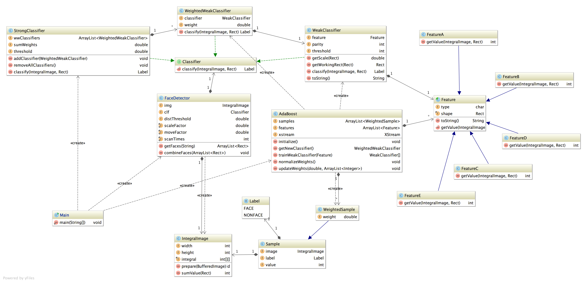
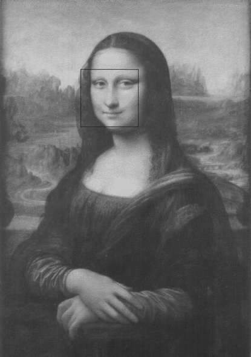

# JFaceDetection

Implementation of AdaBoost and face detection using AdaBoost, written in Java.

Homework #1 of "Fundamentals of Machine Learning"(04802020) @ Peking University.

NOTICE: This project is mainly used to demonstrate the principle of face detection using AdaBoost, as well as good object-oriented design.

## Class Diagram

## Features

- AdaBoost algorithm
- Haar feature classifier
- Integral image acceleration
- Histogram equalization
- XML serialization
- etc.

## Some Results

see more results under `static` folder.

## References

[1] Viola P, Jones M J. Robust real-time face detection[J]. International journal of computer vision, 2004, 57(2): 137-154.

[2] 赵楠, 查红彬. 基于 Adaboost 算法的人脸检测 [D][J]. 北京: 北京大学物理学院视觉与听觉信息处理国家重点实验室, 2005.